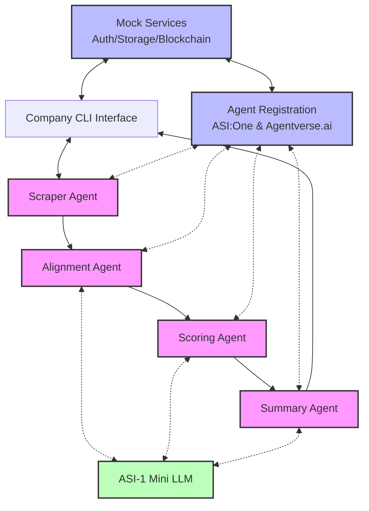

# Multi-Agent Lead Generation System Architecture

This document outlines the architecture of the multi-agent lead generation system built for the hackathon using uAgents and ASI-1 Mini LLM.

## System Overview

The system consists of four specialized agents that work together to provide intelligent lead generation and filtering:

1. **Scraper Agent**: Retrieves potential leads from various sources (mocked for demo)
2. **Alignment Agent**: Uses ASI-1 Mini to match leads with company requirements
3. **Scoring Agent**: Uses ASI-1 Mini to evaluate and price leads
4. **Summary Agent**: Uses ASI-1 Mini to generate context-aware summaries with knowledge graph connections

## Architecture Diagram

## Agent Communication Flow

1. **Company** submits sales specification via CLI
2. **Scraper Agent** retrieves potential leads from mock data
3. **Alignment Agent** uses ASI-1 Mini to match leads with company's sales spec
4. **Scoring Agent** uses ASI-1 Mini to score and price leads
5. **Summary Agent** uses ASI-1 Mini to generate intelligent summaries
6. **Company** views and purchases leads via CLI
7. **Mock blockchain** transaction reveals full lead details

## Key Components

### Company CLI Interface
- Allows companies to authenticate, submit sales specs, and view lead summaries
- Simulates payment flow for lead contact information

### Scraper Agent
- Retrieves potential leads from mock data
- Registered on ASI:One and Agentverse.ai
- Sends leads to Alignment Agent

### Alignment Agent
- Uses ASI-1 Mini to match leads with company requirements
- Performs intent matching and keyword extraction
- Registered on ASI:One and Agentverse.ai
- Sends filtered leads to Scoring Agent

### Scoring Agent
- Uses ASI-1 Mini for multi-factor lead evaluation
- Calculates lead prices based on quality and fit
- Registered on ASI:One and Agentverse.ai
- Sends scored leads to Summary Agent

### Summary Agent
- Uses ASI-1 Mini for context-aware summarization
- Generates TLDR and detailed summaries
- Identifies knowledge graph connections
- Registered on ASI:One and Agentverse.ai
- Sends summaries back to Company CLI

### Mock Services
- **Self Authentication**: User management and authentication
- **Walrus Storage**: Local JSON storage for agent data
- **OG Network**: Mock blockchain transactions for lead purchases

### Agent Registration
- Simulates registration on ASI:One and Agentverse.ai
- Stores agent metadata and capabilities
- Makes agents discoverable in the ecosystem

## ASI-1 Mini Integration Points

ASI-1 Mini LLM is integrated at three key points in the system:

1. **Alignment Agent**: Intent matching, keyword extraction
2. **Scoring Agent**: Multi-factor lead evaluation
3. **Summary Agent**: Context-aware summarization, knowledge graph connections

## Data Flow

- **Sales Specification**: Company → Scraper Agent
- **Lead Data**: Progressively enriched through the agent pipeline
- **Lead Summaries**: Summary Agent → Company
- **Payment Flow**: Company → Mock Blockchain → Lead Contact Reveal

## Technologies Used

- **uAgents Framework**: For agent creation and communication
- **ASI-1 Mini LLM**: For intelligent processing (mocked for demo)
- **Python**: Core programming language
- **JSON**: Data storage and exchange format
- **Pydantic Models**: For typed message passing between agents
